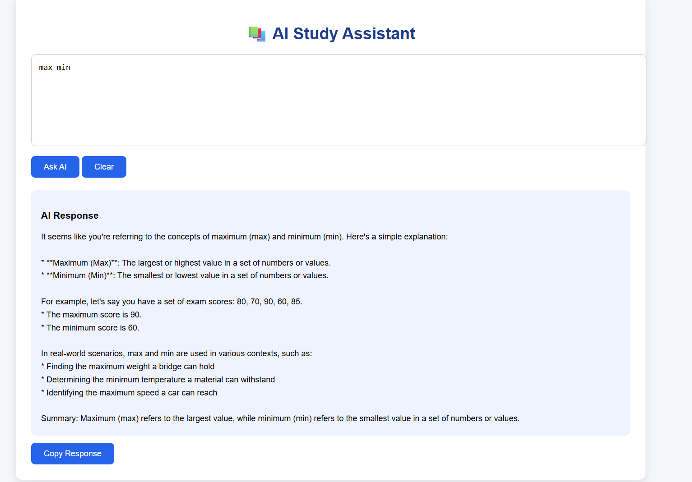
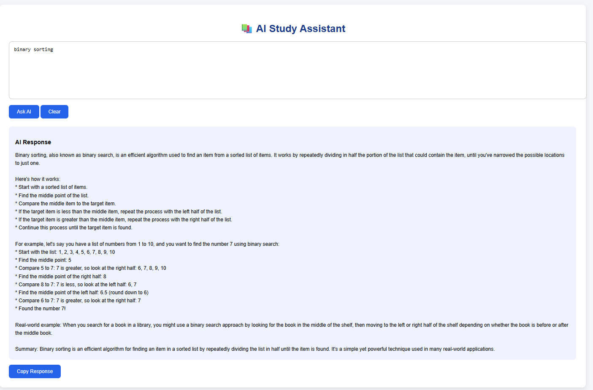

# AI Study Assistant

## Participant Details
- Name: Manu Krishna C.K.
- MUID: manukrishnack-1@mulearn

## Project Overview
AI Study Assistant is a web application that uses a Large Language Model (LLM) to answer study-related questions, explain concepts, generate concise notes, and compare technical topics in an easy-to-understand format.

## Use Case
Students often struggle to understand complex concepts. This application provides instant AI-powered explanations and revision notes.

## Features
- AI-powered question answering
- Simple concept explanations
- Notes generation
- Topic comparison
- Clean web interface
- Copy and clear response options

## Tech Stack
- FastAPI
- HTML
- CSS
- JavaScript
- Groq API
- Llama 3.3 70B Versatile
- Netlify
- Render

## AI Platform
Groq API using Llama 3.3 70B Versatile.

## Prompt Engineering
The system prompt instructs the model to:
- Explain concepts simply
- Use examples
- Generate concise notes
- Compare topics in tables
- End responses with summaries

## Observations
- Groq provides very fast inference.
- Prompt engineering significantly improves response quality.
- Clear prompts produce more structured answers.

## Challenges
- Deploying frontend and backend separately.
- Handling CORS.
- Configuring environment variables.
- Connecting Netlify with Render.

## Future Improvements
- Chat history
- PDF upload
- Voice input
- Dark mode
- User authentication
- Export responses as PDF

## Screenshots

## Deployment
Frontend: https://spectacular-horse-9b08cc.netlify.app/

Backend: https://epochs-task10-ai-study-assistant.onrender.com

## GitHub Repository
https://github.com/manukrishna804/EPOCHS-DATA-SCIENCE.git