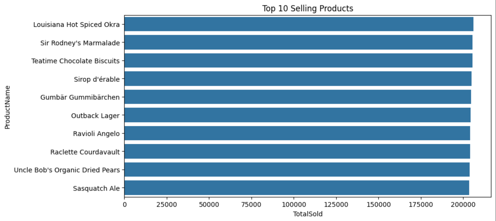
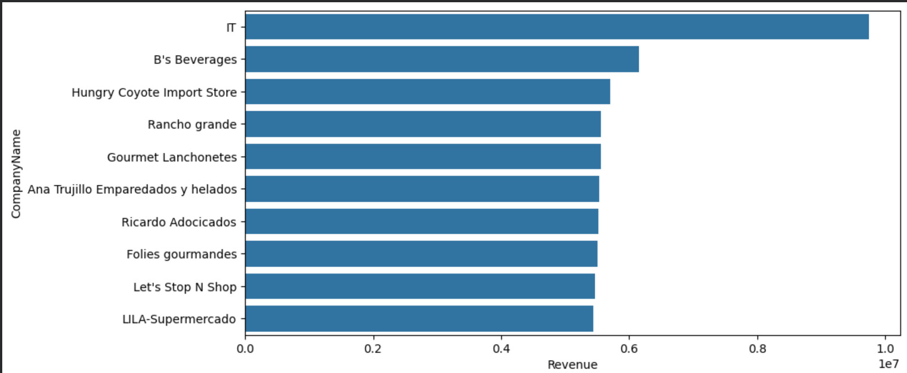
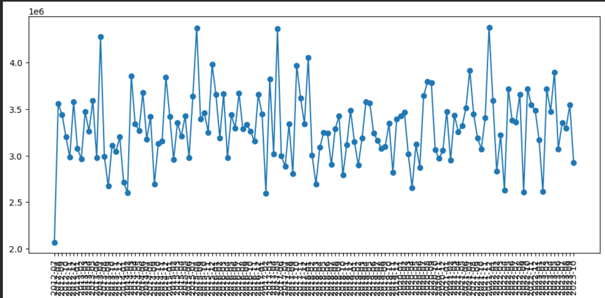
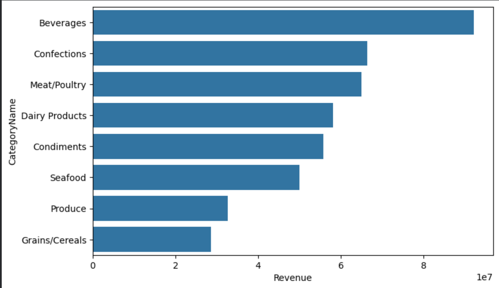
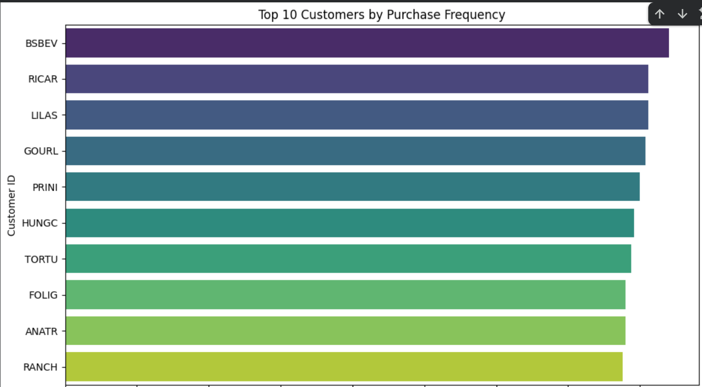

# 🛒 Northwind Database SQL & Business Analysis

## 📌 Project Overview

This project explores the **Northwind Database** using SQL and Python. The objective is to answer real-world business questions through SQL queries, analyze the results using Pandas, and derive meaningful business insights.

This project was completed as part of the **EVN DS Epochs 2026 - Day 02 Assignment**.

---

## 📂 Dataset

**Database Name:** Northwind Database

**Source:** https://github.com/jpwhite3/northwind-SQLite3

### Database Description

The Northwind database is a sample relational database representing a trading company. It contains information about:

- Customers
- Orders
- Order Details
- Products
- Categories
- Suppliers
- Employees
- Shippers

The database is widely used for learning SQL, database management, and business analytics.

---

# 🎯 Objectives

The objectives of this project are to:

- Perform SQL queries to answer business-related questions.
- Analyze sales and customer behavior.
- Import SQL query results into Pandas.
- Perform exploratory data analysis (EDA).
- Generate actionable business insights.

---

# 💼 Business Questions

The following business questions were answered using SQL:

1. What are the Top 10 selling products?
2. Who are the Top 10 customers by revenue?
3. What are the monthly sales trends?
4. Which product categories generate the highest revenue?
5. How frequently do customers make purchases?

---

# 🗂 SQL Analysis

The SQL queries are provided in the **`queries.sql`** file.

The following operations were performed:

- Product sales analysis
- Customer revenue analysis
- Monthly sales trend analysis
- Category-wise revenue analysis
- Customer purchase frequency analysis

---

# 📊 Pandas Analysis

The SQL query results were imported into Pandas for further analysis.

The following analyses were performed:

- Data loading into DataFrames
- Summary statistics
- Data inspection
- Business trend analysis
- Data visualization using Matplotlib and Seaborn

---
## 📷 SQL Output Screenshots

### Top 10 Selling Products



---

### Top 10 Customers by Revenue



---

### Monthly Sales Trend



---

### Best Performing Categories



---

### Customer Purchase Frequency



# 📈 Business Insights

### Insight 1

A small number of products contribute significantly to total sales, indicating that a few products are the primary revenue drivers.

### Insight 2

The highest-paying customers generate a substantial portion of overall revenue, making customer retention an important business strategy.

### Insight 3

Monthly sales exhibit noticeable fluctuations, suggesting seasonal demand patterns and opportunities for targeted marketing campaigns.

### Insight 4

Certain product categories consistently outperform others, helping management prioritize inventory and promotional efforts.

### Insight 5

Some customers place orders much more frequently than others, making them ideal candidates for loyalty programs and personalized offers.

---

# 🛠 Technologies Used

- Google Colab
- SQLite
- SQL
- Python
- Pandas
- Matplotlib
- Seaborn

---

# 📁 Repository Structure

```text
day-2-northwind-analysis/
│
├── analysis.ipynb
├── queries.sql
├── README.md
├── northwind.db
└── screenshots/
    ├── top_products.png
    ├── top_customers.png
    ├── monthly_sales.png
    ├── category_revenue.png
    └── customer_frequency.png
```

---

# 🚀 Conclusion

The Northwind database provides valuable insights into customer purchasing behavior, product performance, and sales trends. By combining SQL with Pandas, meaningful business questions can be answered effectively. The analysis demonstrates how data-driven decision-making can help businesses improve customer engagement, optimize inventory, and increase revenue.

---

## 👨‍💻 Author

**Manu Krishna**

B.Tech Information Technology (4th Year)

Government Engineering College Palakkad

GitHub: https://github.com/manukrishna804