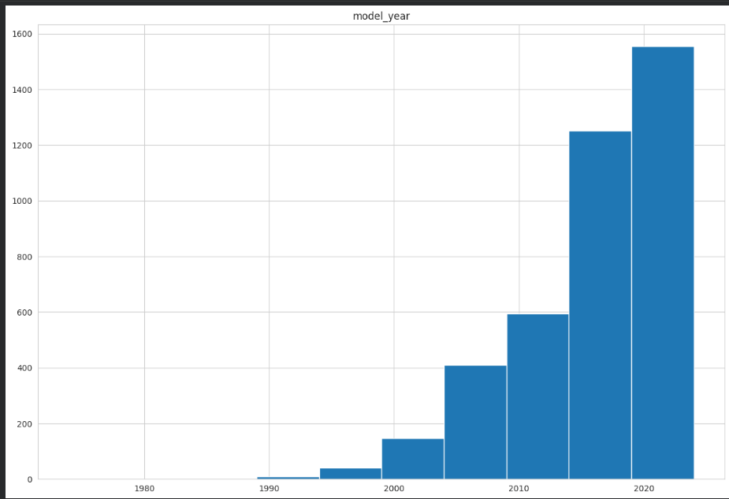
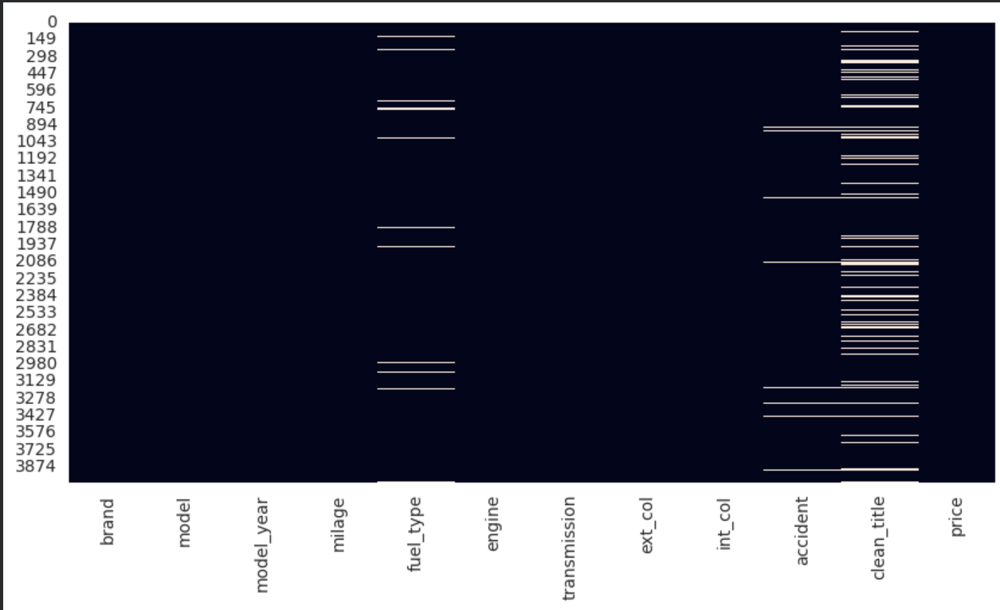
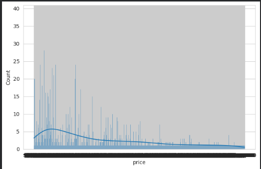
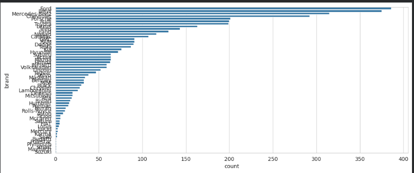
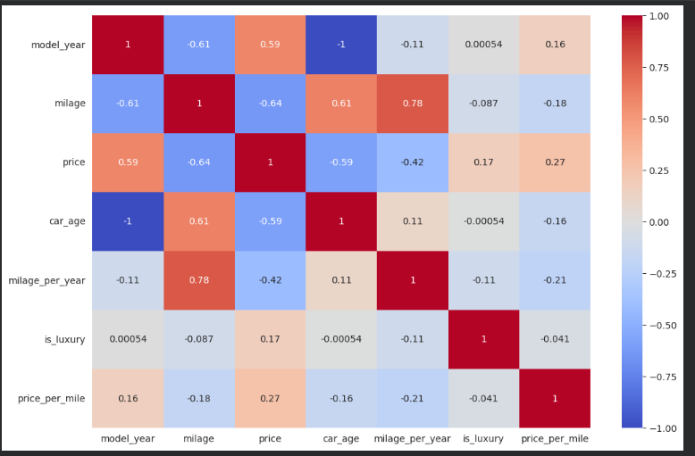
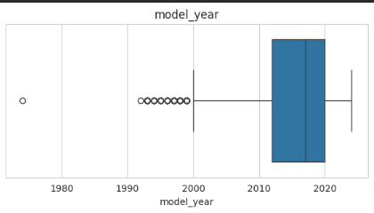

# 🚗 Used Car Price Prediction - EDA & Feature Engineering

## 📌 Project Overview

This project performs Exploratory Data Analysis (EDA), Data Cleaning, and Feature Engineering on the **Used Car Price Prediction** dataset. The goal is to prepare a high-quality dataset for future Machine Learning models by identifying data quality issues, cleaning the data, engineering meaningful features, and extracting insights.

---

## 📂 Dataset

- **Dataset:** Used Car Price Prediction
- **Source:** Kaggle
- **Records:** 4009
- **Features:** 12

---

## 📊 Exploratory Data Analysis

The following analyses were performed:

- Dataset exploration
- Descriptive statistics
- Numerical and categorical feature identification
- Missing value analysis
- Duplicate record detection
- Distribution analysis
- Correlation analysis
- Outlier detection

### Distribution of Numerical Features



---

### Missing Values



---

### Price Distribution



---

### Brand Distribution



---

### Correlation Matrix



---

### Boxplots (Outlier Analysis)



---

# 🧹 Data Quality Issues Identified

- Missing values in:
  - `fuel_type`
  - `accident`
  - `clean_title`
- Mileage stored as text instead of numeric values
- Presence of price outliers
- Duplicate records (if any)

---

# 🛠 Data Cleaning

The following preprocessing steps were performed:

- Filled missing categorical values using Mode
- Filled missing numerical values using Median (if required)
- Converted mileage into numeric format
- Removed duplicate records
- Removed outliers using the IQR method
- Verified correct data types

---

# ⚙ Feature Engineering

Five new features were created:

| Feature | Description |
|----------|-------------|
| Car Age | Current Year − Model Year |
| Mileage Per Year | Mileage divided by Car Age |
| Luxury Brand | Indicates whether the car belongs to a luxury brand |
| Price Per Mile | Price divided by mileage |
| Usage Category | Categorizes vehicles into Low, Medium, and High usage |

---

# 📈 Key Insights

1. Vehicle prices generally decrease as mileage increases.
2. Luxury brands have significantly higher resale values.
3. Most listed vehicles belong to a few popular manufacturers.
4. Price distribution is positively skewed due to premium vehicles.
5. Newer vehicles tend to have higher market prices.

---

# 💾 Output

- `task-3.ipynb`
- `cleaned_used_cars.csv`

---

# 🛠 Technologies Used

- Python
- Pandas
- NumPy
- Matplotlib
- Seaborn
- Google Colab

---

# 📌 Repository Structure

```
Used-Car-Price-Prediction-EDA/
│
├── task-3.ipynb
├── cleaned_used_cars.csv
├── README.md
├── images/
│   ├── distribution.png
│   ├── missing_values.png
│   ├── price_distribution.png
│   ├── brand_distribution.png
│   ├── correlation_matrix.png
│   └── boxplots.png
```

---

## ⭐ Assignment

Epochs '26 - Assignment 3

Exploratory Data Analysis, Data Cleaning, and Feature Engineering on the Used Car Price Prediction Dataset.