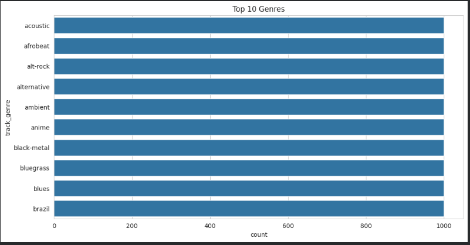
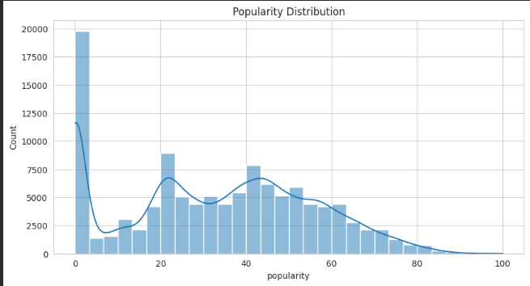
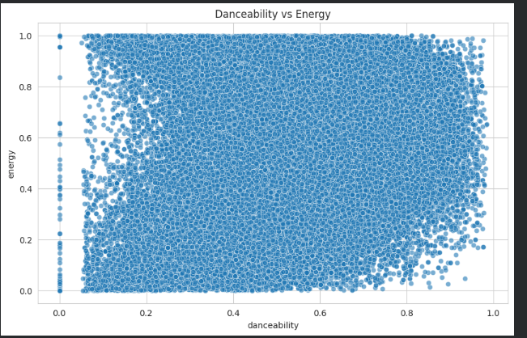
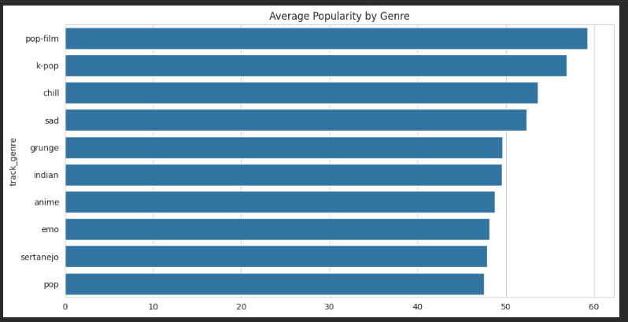
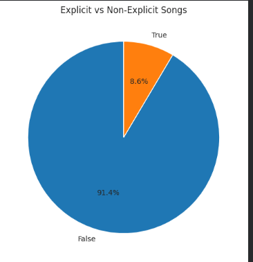
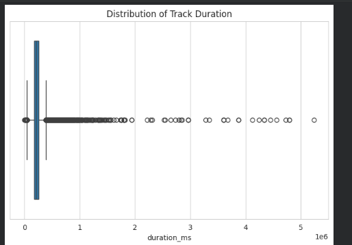

# 🎵 Spotify Tracks Data Visualization

## 📌 Project Overview

This project performs **Exploratory Data Analysis (EDA)** and **Data Visualization** on the Spotify Tracks Dataset using **Python, Pandas, Matplotlib, and Seaborn**. The objective is to explore the characteristics of Spotify tracks, identify patterns among audio features, and communicate meaningful insights through effective visualizations and data storytelling.

---

# 📂 Dataset

**Dataset:** Spotify Tracks Dataset

The dataset contains information about thousands of Spotify tracks, including:

- Track Name
- Artist
- Album
- Popularity
- Genre
- Danceability
- Energy
- Loudness
- Acousticness
- Instrumentalness
- Liveness
- Speechiness
- Tempo
- Valence
- Duration
- Explicit Content
- Other Spotify Audio Features

These features help analyze the musical characteristics and popularity of songs across different genres.

---

# 🎯 Objectives

The goals of this project are:

- Perform Exploratory Data Analysis (EDA)
- Understand the structure of the dataset
- Identify numerical and categorical features
- Check missing values and duplicate records
- Analyze relationships among different audio features
- Create meaningful visualizations using Matplotlib and Seaborn
- Interpret the visualizations and communicate insights through data storytelling

---

# 🛠️ Technologies Used

- Python
- Pandas
- NumPy
- Matplotlib
- Seaborn
- Jupyter Notebook

---

# 🔍 Exploratory Data Analysis (EDA)

The following preprocessing steps were performed:

- Loaded the dataset using Pandas
- Explored dataset dimensions and feature information
- Generated descriptive statistics
- Identified numerical and categorical columns
- Checked for missing values
- Removed duplicate records
- Analyzed feature relationships using a correlation matrix

---

# 📊 Visualizations and Insights

## 1️⃣ Top Genres



### Observation

The chart shows the frequency of the top music genres available in the dataset.

### Inference

- Pop and Rock are among the most represented genres.
- The dataset contains a diverse collection of music genres.
- Popular mainstream genres contribute significantly to the dataset.

---

## 2️⃣ Popularity Distribution



### Observation

The histogram illustrates how track popularity is distributed.

### Inference

- Most tracks have medium popularity.
- Only a small percentage of songs achieve very high popularity.
- Extremely popular songs are relatively rare compared to average-performing tracks.

---

## 3️⃣ Danceability vs Energy



### Observation

The scatter plot compares danceability with energy.

### Inference

- Songs with higher danceability generally exhibit higher energy.
- Although a positive trend exists, some songs are energetic without being highly danceable.
- Musical characteristics vary across genres and artists.

---

## 4️⃣ Average Popularity by Genre



### Observation

This visualization compares the average popularity of different genres.

### Inference

- Certain genres consistently receive higher listener engagement.
- Genre plays an important role in determining song popularity.
- Listener preferences vary across different music styles.

---

## 5️⃣ Explicit vs Non-Explicit Songs



### Observation

The pie chart shows the proportion of explicit and non-explicit songs.

### Inference

- Non-explicit tracks make up the majority of the dataset.
- Explicit content represents only a smaller portion of Spotify tracks.
- Spotify hosts a broad catalog suitable for diverse audiences.

---

## 6️⃣ Track Duration Distribution



### Observation

The boxplot visualizes the distribution of song durations.

### Inference

- Most songs have similar durations.
- A few songs are significantly longer, appearing as outliers.
- The majority of tracks follow standard commercial song lengths.

---

# 📈 Key Findings

- The dataset contains songs from a wide variety of genres.
- Pop and Rock dominate the dataset in terms of frequency.
- Most songs have moderate popularity, while only a few become highly popular.
- Danceability and energy exhibit a generally positive relationship.
- Genre influences average popularity.
- Non-explicit songs are more common than explicit songs.
- Most tracks have standard durations with only a few long-duration outliers.

---

# 💡 Overall Conclusion

The Spotify Tracks Dataset provides valuable insights into modern music trends and audio characteristics. Through exploratory data analysis and visualization, we observed relationships between musical attributes such as danceability, energy, popularity, and genre.

The analysis demonstrates that:

- Popularity is unevenly distributed across tracks.
- Audio features help distinguish different styles of music.
- Genre has a noticeable impact on audience engagement.
- Most songs follow similar production characteristics, while a few unique tracks stand out as outliers.

Overall, this project illustrates how effective data visualization transforms raw data into meaningful stories that support better understanding and informed decision-making.

---

# 📁 Repository Structure

```
Spotify-Track-EDA/
│
├── visualization.ipynb
├── README.md
├── dataset.csv
|
│
└── images/
    ├── plot1.png
    ├── plot2.png
    ├── plot3.png
    ├── plot4.png
    ├── plot5.png
    └── plot6.png
```

---

# 🚀 How to Run

1. Clone this repository.

```bash
git clone <repository-url>
```

2. Install the required libraries.

```bash
pip install pandas numpy matplotlib seaborn notebook
```

3. Launch Jupyter Notebook.

```bash
jupyter notebook
```

4. Open **visualization.ipynb** and run all cells.

---

# 📚 Learning Outcomes

Through this project, the following concepts were practiced:

- Exploratory Data Analysis (EDA)
- Data Cleaning
- Descriptive Statistics
- Correlation Analysis
- Data Visualization
- Data Storytelling
- Insight Generation using Python

---

