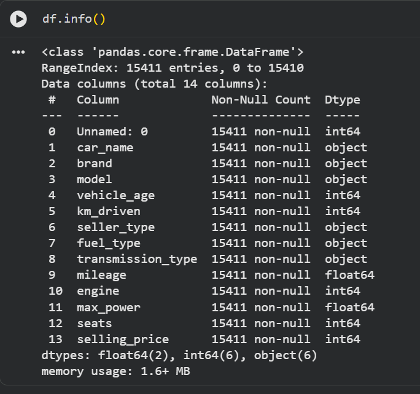
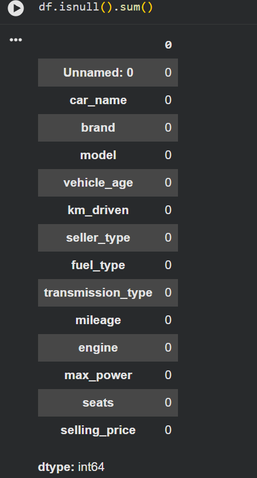
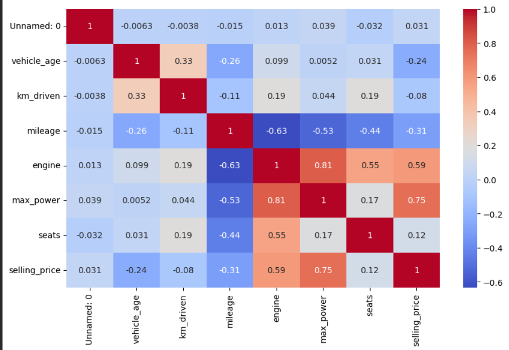
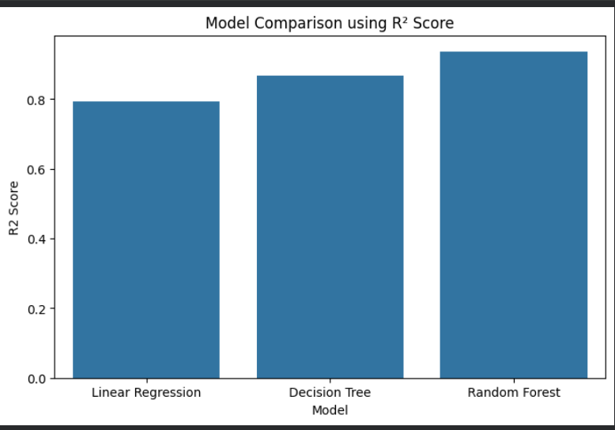
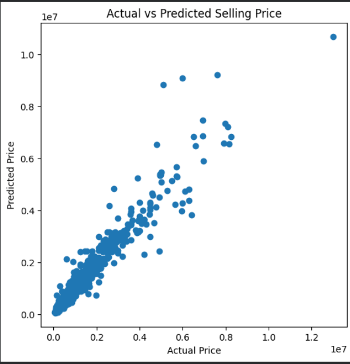
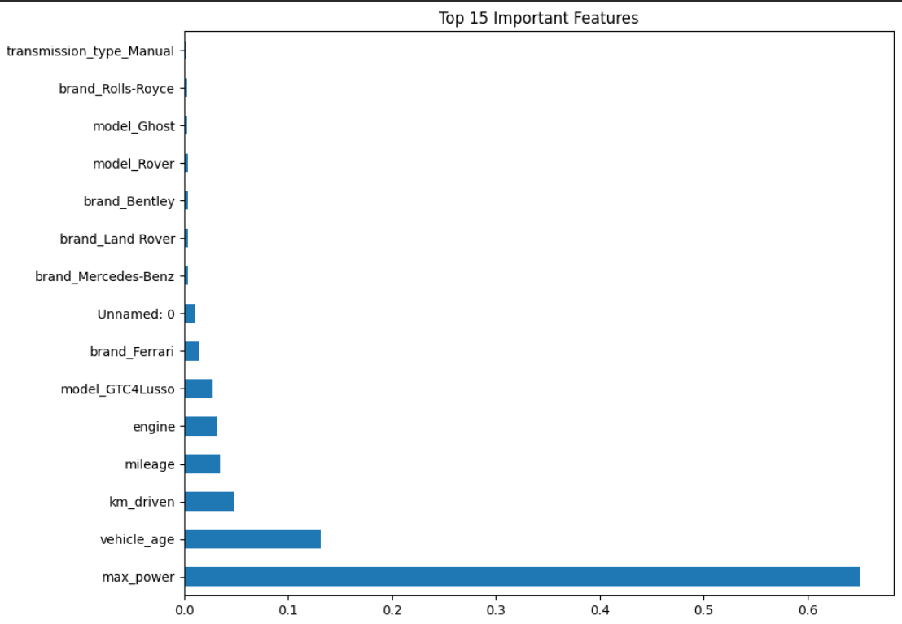

# 🚗 Car Price Prediction using Machine Learning

Predicting the selling price of used cars using Machine Learning Regression models.

---

## 📌 Business Objective

The objective of this project is to build a machine learning model that accurately predicts the **selling price of used cars** based on their specifications such as brand, model, vehicle age, kilometers driven, fuel type, transmission type, engine capacity, mileage, and maximum power.

Accurate price prediction helps:
- Buyers estimate a fair market value.
- Sellers determine competitive selling prices.
- Dealerships automate vehicle valuation.
- Online marketplaces improve pricing recommendations.

---

# 📂 Dataset

**Dataset Name:** CarDekho Used Car Dataset

- Total Records: **15,411**
- Total Features: **14**
- Missing Values: **None**

### Dataset Features

| Feature | Description |
|----------|-------------|
| car_name | Name of the car |
| brand | Manufacturer |
| model | Car model |
| vehicle_age | Age of the vehicle (years) |
| km_driven | Total kilometers driven |
| seller_type | Individual or Dealer |
| fuel_type | Petrol/Diesel/CNG/etc. |
| transmission_type | Manual or Automatic |
| mileage | Mileage of the vehicle |
| engine | Engine capacity (CC) |
| max_power | Maximum engine power |
| seats | Number of seats |
| selling_price | Target Variable |

---
## 📌 Feature Types

### Numerical Features

- vehicle_age
- km_driven
- mileage
- engine
- max_power
- seats

### Categorical Features

- brand
- model
- seller_type
- fuel_type
- transmission_type

# 🎯 Problem Statement

The goal is to predict the **selling price** of a used car using supervised machine learning regression techniques.

Since selling price is a continuous numerical value, this is a **Regression Problem**.

---

# 🎯 Target Variable

```
selling_price
```

---

# 📊 Exploratory Data Analysis (EDA)

The dataset was analyzed to understand the relationships between different features before model training.

## ✔ Dataset Overview

*(Paste Dataset Info Screenshot Here)*



---

## ✔ Missing Values

The dataset contains **no missing values**.

*(Paste Missing Values Screenshot Here)*



---


## ✔ Correlation Heatmap

Correlation between numerical features.

*(Paste Heatmap Here)*



---

# ⚙ Data Preprocessing

The following preprocessing steps were performed:

- Removed unnecessary index column (`Unnamed: 0`)
- Dropped redundant feature (`car_name`)
- Verified there were no missing values
- Applied One-Hot Encoding to categorical features
- Split dataset into training and testing sets (80:20)
- Standardized numerical features for Linear Regression

---
### Preprocessing Justification

- The **Unnamed: 0** column was removed because it only served as an index and provided no predictive value.
- The **car_name** column was dropped because it duplicated information already represented by the **brand** and **model** columns.
- One-Hot Encoding was applied to categorical variables to convert them into numerical features suitable for machine learning models.
- StandardScaler was used for Linear Regression because scaling improves optimization when features have different ranges.
- The dataset was split into **80% training** and **20% testing** to evaluate model performance on unseen data.

# 🛠 Feature Engineering

Feature engineering improves model performance by preparing the dataset appropriately.

### Steps Performed

- Removed duplicate information
- Converted categorical variables into numerical values using One-Hot Encoding
- Created machine learning-ready feature matrix

---

# 🤖 Machine Learning Models

The following regression models were implemented:

## 1️⃣ Linear Regression

Linear Regression assumes a linear relationship between independent variables and selling price.

---

## 2️⃣ Decision Tree Regressor

Decision Tree captures nonlinear relationships by recursively splitting the dataset.

---

## 3️⃣ Random Forest Regressor

Random Forest combines multiple Decision Trees to improve prediction accuracy and reduce overfitting.

---

# 📈 Model Evaluation Metrics

The following evaluation metrics were used:

- Mean Absolute Error (MAE)
- Mean Squared Error (MSE)
- Root Mean Squared Error (RMSE)
- R² Score

---

# 📊 Model Performance Comparison


Model	MAE	MSE	RMSE	R2 Score
0	Linear Regression	179223.506085	1.563074e+11	395357.297678	0.792360
1	Decision Tree	127199.764839	9.869651e+10	314160.002840	0.868891
2	Random Forest	95427.455401	4.785081e+10	218748.269202	0.936435

*(Fill this table with your actual results.)*

---
# 📊 Model Analysis

## Linear Regression

### Strengths
- Simple and fast
- Easy to interpret
- Works well for linear relationships

### Limitations
- Cannot capture complex nonlinear relationships
- Sensitive to outliers

---

## Decision Tree Regressor

### Strengths
- Handles nonlinear data
- Easy to visualize
- No feature scaling required

### Limitations
- Prone to overfitting
- High variance

---

## Random Forest Regressor

### Strengths
- High prediction accuracy
- Reduces overfitting using multiple trees
- Handles nonlinear relationships effectively

### Limitations
- More computationally expensive
- Less interpretable than a single Decision Tree

## 📊 Model Comparison Graph

*(Paste Comparison Chart Here)*



---

## 📊 Actual vs Predicted Values

Random Forest Prediction Performance

*(Paste Scatter Plot Here)*



---

## 📊 Feature Importance

Top important features identified by the Random Forest model.




---

# 🏆 Best Performing Model

**Random Forest Regressor**

### Why?

- Highest R² Score
- Lowest RMSE
- Lowest MAE
- Handles nonlinear relationships effectively
- Reduces overfitting through ensemble learning
- More robust than a single Decision Tree

---

# 📌 Key Observations

- Vehicle age negatively affects selling price.
- Cars with lower kilometers driven generally have higher resale value.
- Engine capacity and maximum power significantly influence price.
- Automatic transmission vehicles tend to have higher selling prices.
- Brand plays an important role in determining resale value.
- Random Forest achieved the best predictive performance.

---

# 🚀 Future Improvements

- Hyperparameter tuning using GridSearchCV
- Cross-validation for better model generalization
- Feature selection techniques
- Outlier detection and removal
- Try advanced ensemble models such as:
  - XGBoost
  - LightGBM
  - CatBoost
- Deploy the trained model as a web application using Flask or Streamlit

---

# 🧰 Technologies Used

- Python
- Pandas
- NumPy
- Matplotlib
- Seaborn
- Scikit-learn
- Jupyter Notebook

---

# 📁 Project Structure

```
Car-Price-Prediction/
│
├── car_price_prediction.ipynb
├── README.md
├── dataset/
│     └── used_car_dataset.csv
│
├── images/
│     ├── dataset_info.png
│     ├── missing_values.png
│     ├── selling_price_distribution.png
│     ├── correlation_heatmap.png
│     |
│     ├
│     ├── model_comparison.png
│     ├── actual_vs_predicted.png
│     └── feature_importance.png
│

```

---

# ▶ How to Run the Project

### Clone the Repository

```bash
git clone https://github.com/your-username/Car-Price-Prediction.git
```

### Navigate to the Project Directory

```bash
cd Car-Price-Prediction
```

### Install Dependencies

```bash
pip install -r requirements.txt
```

### Run the Notebook

```bash
jupyter notebook
```

Open:

```
car_price_prediction.ipynb
```

---


