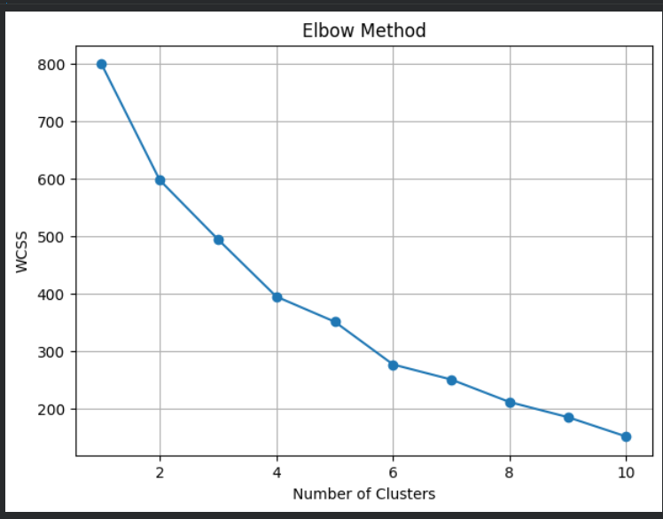
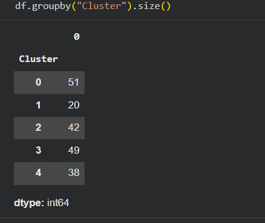
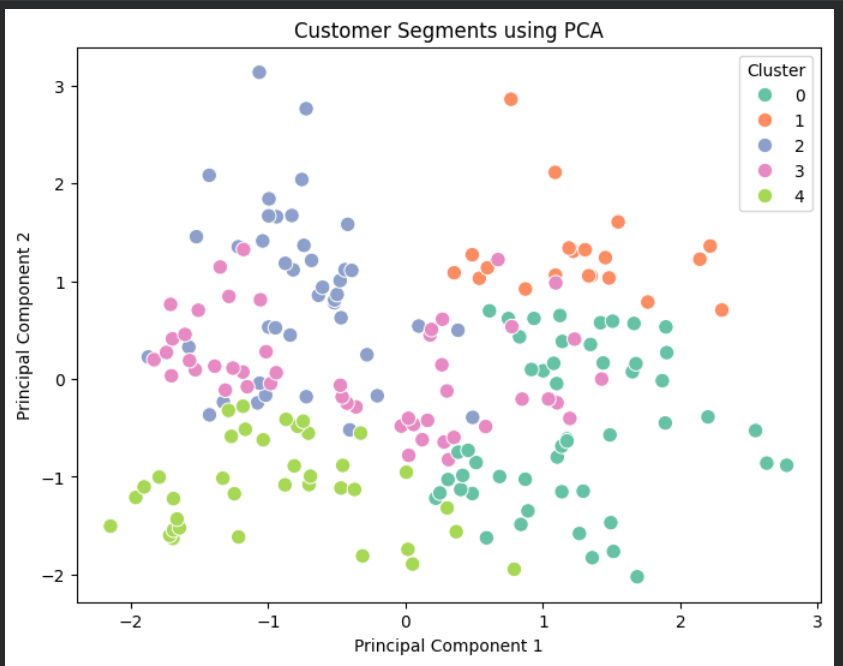

# Customer Segmentation using K-Means Clustering

**Name:** Manukrishna CK  
**MUID:** manukrishnack-1@mulearn

---

# 📌 Project Overview

This project applies **K-Means Clustering**, an unsupervised machine learning algorithm, to segment mall customers into meaningful groups based on their demographic and spending behavior. The project also uses **Principal Component Analysis (PCA)** to reduce the dataset into two dimensions for visualization, helping identify hidden customer patterns and support data-driven business decisions.

---

# 📂 Dataset

**Dataset:** Mall Customer Segmentation Dataset

### Features

| Feature | Description |
|---------|-------------|
| CustomerID | Unique customer identifier |
| Gender | Customer gender |
| Age | Age of the customer |
| Annual Income (k$) | Annual income in thousand dollars |
| Spending Score (1-100) | Spending score assigned by the mall |

---

# 🎯 Objectives

- Load and explore the dataset
- Handle missing values
- Encode categorical features
- Scale the data for clustering
- Determine the optimal number of clusters using the Elbow Method
- Train a K-Means clustering model
- Assign customers to clusters
- Analyze customer segments
- Apply PCA for visualization
- Generate business insights

---

# 🛠️ Technologies Used

- Python
- Pandas
- NumPy
- Matplotlib
- Seaborn
- Scikit-learn
- Google Colab

---

# 🔄 Workflow

### 1. Data Loading

- Loaded the Mall Customers dataset using Pandas.
- Displayed the first few records for inspection.

### 2. Exploratory Data Analysis

Performed:

- Dataset shape
- Dataset information
- Statistical summary
- Missing value check
- Duplicate value check

### 3. Data Preprocessing

- Removed missing values (if any).
- Encoded the **Gender** column using **LabelEncoder**.
- Removed the **CustomerID** column since it does not contribute to clustering.

### 4. Feature Scaling

Applied **StandardScaler** to normalize all features before clustering.

**Why scaling?**

K-Means uses Euclidean distance. Without scaling, features with larger values would dominate the clustering process.

### 5. Elbow Method

Used the Elbow Method to determine the optimal number of clusters.

**Optimal number of clusters: 5**

### 6. K-Means Clustering

- Trained a K-Means model with **5 clusters**.
- Assigned each customer to a cluster.

### 7. Cluster Profiling

Calculated the average characteristics of each cluster and analyzed the size of each customer segment.

### 8. Principal Component Analysis (PCA)

Applied PCA with **2 principal components** to visualize customer clusters in two-dimensional space.

---

# 📊 Results

## Elbow Method

The Elbow Method indicates that **5 clusters** provide the optimal balance between cluster compactness and model simplicity.



---

## Cluster Profile

Average feature values for each customer cluster.



---

## PCA Visualization

Customer segments projected into two dimensions using PCA.



---

# 📈 Customer Segments

The K-Means algorithm divided customers into **five distinct groups** based on similarities in age, annual income, gender, and spending score.

Example interpretation:

| Cluster | Customer Segment |
|----------|------------------|
| Cluster 0 | Budget Customers |
| Cluster 1 | High Income - High Spending |
| Cluster 2 | Average Customers |
| Cluster 3 | Young High Spenders |
| Cluster 4 | Potential Loyal Customers |

> **Note:** Segment names are based on the characteristics observed in each cluster profile.

---

# 💡 Business Insights

### 🟢 Budget Customers

- Low spending behavior
- Price-sensitive customers
- Respond well to discounts and promotional offers

### 🔵 High Income - High Spending Customers

- Premium customer segment
- Most valuable customers
- Suitable for VIP memberships and exclusive services

### 🟡 Average Customers

- Moderate income and spending
- Good candidates for loyalty programs and cross-selling

### 🟣 Young High Spenders

- Frequently purchase trendy products
- Target through personalized recommendations and digital marketing

### 🟠 Potential Loyal Customers

- Moderate spending with growth potential
- Encourage repeat purchases using reward programs and personalized offers

---

# 📌 Conclusion

This project demonstrates the effectiveness of **Unsupervised Learning** for discovering hidden customer groups without labeled data.

### Key Findings

- Data preprocessing and feature scaling improved clustering performance.
- The Elbow Method identified **5** as the optimal number of customer segments.
- K-Means successfully grouped customers with similar purchasing behavior.
- PCA reduced the dataset to two dimensions, enabling clear visualization of customer clusters.
- Customer segmentation helps businesses create targeted marketing campaigns, improve customer satisfaction, and increase revenue.

---

# 📁 Repository Structure

```
task-7/
│
├── customer_segmentation.ipynb
├── README.md
│
├── datasets/
│   └── Mall_Customers.csv
│
└── images/
    ├── elbow_method.png
    ├── cluster_profile.png
    └── pca_visualization.png
```

---

# ▶️ How to Run

### Clone the repository

```bash
git clone https://github.com/your-username/customer-segmentation-kmeans.git
```

### Install dependencies

```bash
pip install pandas numpy matplotlib seaborn scikit-learn
```

### Run the notebook

```bash
jupyter notebook customer_segmentation.ipynb
```

---

# 📚 Learning Outcomes

- Unsupervised Learning
- Customer Segmentation
- K-Means Clustering
- Label Encoding
- Feature Scaling
- Elbow Method
- Principal Component Analysis (PCA)
- Business Insight Generation

---

## ⭐ Epochs '26 - Assignment 7

Developed as part of the **Epochs '26 Data Science Bootcamp**.