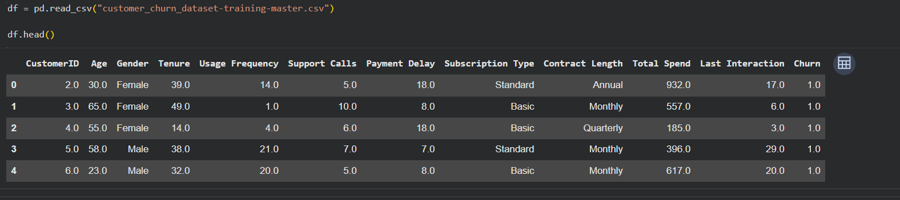
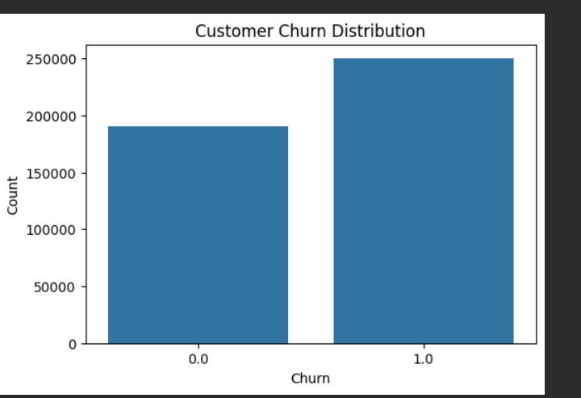
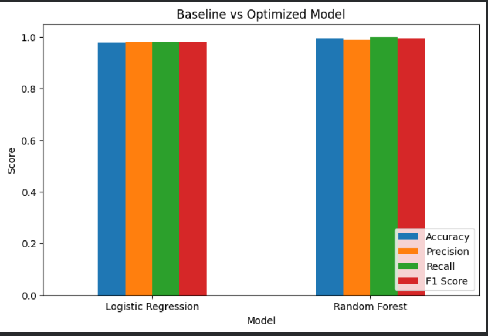
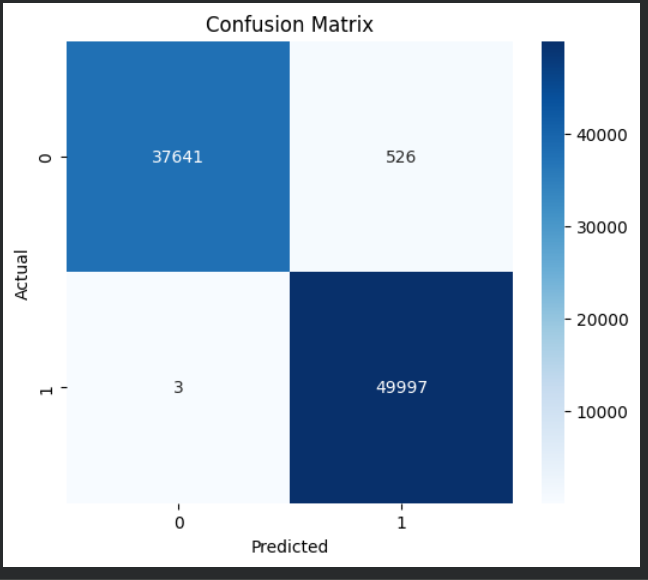
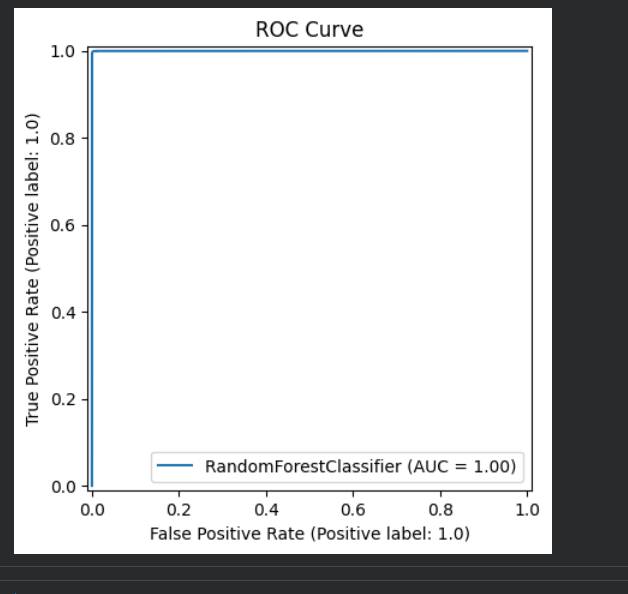
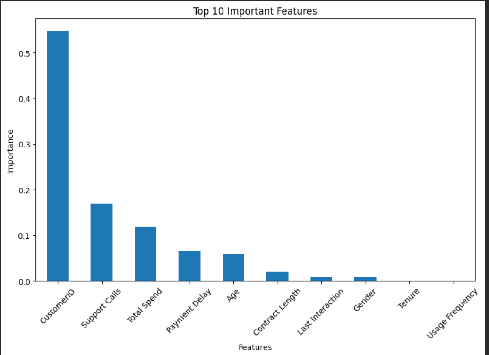
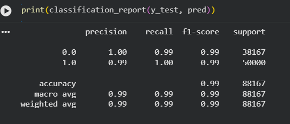

# Customer Churn Prediction - Model Optimization

**Name:** Manu Krishna C K
**MUID:**  manukrishnack-1@mulearn

---

# Customer Churn Prediction using Machine Learning

## Project Overview

Customer churn prediction is a crucial business problem that helps organizations identify customers who are likely to discontinue their services. By predicting churn in advance, businesses can implement targeted retention strategies, improve customer satisfaction, and reduce revenue loss.

This project builds a **baseline Logistic Regression model** and an **optimized Random Forest model** to predict customer churn. The models are evaluated using multiple classification metrics, compared to assess performance improvements, and analyzed to determine the most influential factors affecting customer churn.

---

## Dataset

* **Dataset:** Customer Churn Dataset
* **Source:** Kaggle
* **Target Variable:** Churn

The dataset contains customer demographic information, account details, subscription information, service usage, and churn status.

---

## Objectives

* Build a baseline classification model.
* Optimize the machine learning model.
* Compare baseline and optimized models.
* Evaluate model performance using multiple metrics.
* Identify important features influencing customer churn.
* Provide business recommendations based on model insights.

---

## Technologies Used

* Python
* Pandas
* NumPy
* Matplotlib
* Seaborn
* Scikit-learn

---

# Project Workflow

```text
Load Dataset
      │
Data Cleaning
      │
Handle Missing Values
      │
Encode Categorical Features
      │
Feature Scaling
      │
Train-Test Split
      │
Baseline Model
(Logistic Regression)
      │
Performance Evaluation
      │
Optimized Model
(Random Forest)
      │
Model Comparison
      │
Feature Importance Analysis
      │
Business Recommendations
```

---

# Repository Structure

```text
Customer-Churn-Model-Optimization/
│
├── customer_churn_dataset.csv
├── model_optimization.ipynb
├── README.md
├── requirements.txt
│
└── images/
    ├── dataset_preview.png
    ├── churn_distribution.png
    ├── model_comparison.png
    ├── confusion_matrix.png
    ├── roc_curve.png
    ├── feature_importance.png
    └── classification_report.png
```

---

# Model Development

## Baseline Model

* Logistic Regression

## Optimized Model

* Random Forest Classifier

Optimization was achieved by tuning model parameters such as:

* Number of estimators
* Maximum tree depth
* Minimum samples required for node splitting

---

# Evaluation Metrics

The following metrics were used to evaluate both models:

* Accuracy
* Precision
* Recall
* F1 Score
* ROC-AUC Score
* Confusion Matrix
* Classification Report

---

# Dataset Preview

<p align="center">

</p>

---

# Customer Churn Distribution

<p align="center">

</p>

This visualization shows the distribution of customers who stayed versus those who churned.

---

# Model Performance Comparison

<p align="center">

</p>

The optimized Random Forest model demonstrates improved predictive performance compared to the baseline Logistic Regression model.

---

# Confusion Matrix

<p align="center">

</p>

The confusion matrix summarizes the classification performance of the optimized model.

---

# ROC Curve

<p align="center">

</p>

The ROC curve illustrates the trade-off between the True Positive Rate and False Positive Rate.

---

# Feature Importance

<p align="center">

</p>

The Random Forest model identifies the most influential features affecting customer churn.

Some of the most significant features include:

* Customer Tenure
* Monthly Charges
* Contract Type
* Total Charges
* Internet Service
* Payment Method

---

# Classification Report

<p align="center">

</p>

The classification report summarizes Precision, Recall, F1-score, and Support for each class.

---

# Key Findings

* The optimized Random Forest model achieved better performance than the Logistic Regression baseline.
* Feature importance analysis revealed that customer tenure, monthly charges, and contract type significantly influence customer churn.
* Customers with shorter tenure are more likely to discontinue their services.
* Long-term contracts reduce the probability of customer churn.
* Higher monthly charges are associated with an increased likelihood of churn.

---

# Business Recommendations

* Identify customers with high churn probability and implement targeted retention campaigns.
* Encourage customers to switch to long-term contracts through promotional offers.
* Improve customer onboarding and engagement during the initial subscription period.
* Provide proactive customer support for customers identified as high-risk.
* Regularly monitor churn predictions to improve customer retention strategies.

---

# Model Improvements

| Model               | Description                                          |
| ------------------- | ---------------------------------------------------- |
| Logistic Regression | Baseline classification model                        |
| Random Forest       | Optimized model with improved predictive performance |

---

# Conclusion

This project demonstrates the effectiveness of machine learning model optimization for customer churn prediction. The optimized Random Forest model outperformed the baseline Logistic Regression model across multiple evaluation metrics. Feature importance analysis provided valuable insights into the factors influencing customer churn, enabling businesses to make informed decisions and develop proactive customer retention strategies.

---

**⭐ If you found this project useful, consider giving it a star!**
