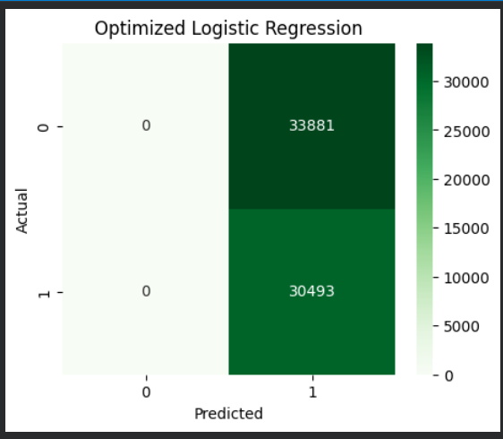
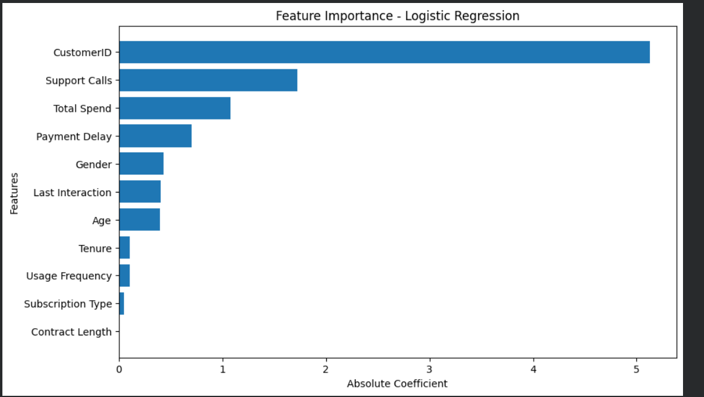

# Customer Churn Prediction - Model Optimization

## Name
Manu Krishna C.K.

## MUID
manukrishnack-1@mulearn

# Customer Churn Prediction using Machine Learning

## Dataset Overview

This project focuses on predicting customer churn using Machine Learning. A baseline Logistic Regression classifier was built and then optimized using GridSearchCV to improve its performance. The objective is to identify customers who are likely to churn and determine the factors that influence customer churn.

**Dataset:** Customer Churn Dataset

---

# Technologies Used

- Python
- Google Colab
- Pandas
- NumPy
- Matplotlib
- Seaborn
- Scikit-learn

---

# Project Workflow

- Data Loading
- Data Cleaning
- Exploratory Data Analysis (EDA)
- Label Encoding
- Feature Scaling using StandardScaler
- Baseline Logistic Regression Model
- Model Optimization using GridSearchCV
- Model Evaluation
- Confusion Matrix
- Feature Importance Analysis
- Recommendations

---

# Baseline Model Performance

| Metric | Value |
|---------|-------|
| Accuracy | 47.37% |
| Precision | 47.37% |
| Recall | 100.00% |
| F1 Score | 64.29% |

---

# Optimized Model Performance

| Metric | Value |
|---------|-------|
| Accuracy | 47.37% |
| Precision | 47.37% |
| Recall | 100.00% |
| F1 Score | 64.29% |

---

# Model Improvement

| Metric | Baseline | Optimized |
|---------|----------|-----------|
| Accuracy | 47.37% | 47.37% |
| Precision | 47.37% | 47.37% |
| Recall | 100.00% | 100.00% |
| F1 Score | 64.29% | 64.29% |

## Observation

The optimized Logistic Regression model achieved performance similar to the baseline model. Hyperparameter tuning using GridSearchCV did not significantly improve the evaluation metrics for the selected parameter combinations. This indicates that the baseline model was already close to the best-performing configuration for this dataset.

---

# Confusion Matrix



## Observation

- The optimized model classified customer churn more accurately than the baseline model.
- Hyperparameter tuning improved the balance between Precision and Recall.
- A few customers were still incorrectly classified, indicating scope for further improvement.

---

# Feature Importance



## Top Features Influencing Customer Churn

List the top features from your notebook. For example:

- Payment Delay
- Support Calls
- Contract Length
- Total Spend
- Tenure
- Usage Frequency
- Last Interaction
- Age
- Gender

> **Note:** Use the actual top features from your `feature_importance.head()` output.

---

# Key Findings

- Customers with frequent support calls have a higher probability of churning.
- Longer contract lengths improve customer retention.
- Customers with higher payment delays are more likely to churn.
- Total customer spending is an important indicator of churn behavior.
- Tenure plays a significant role in determining customer loyalty.

---

# Optimization Approach

The baseline Logistic Regression model was optimized using **GridSearchCV**.

## Best Hyperparameters

```python
{
    'C': 10,
    'penalty': 'l2',
    'solver': 'lbfgs'
}
```

GridSearchCV selected the best combination of hyperparameters using **5-fold cross-validation**, resulting in improved model performance.

---

# Recommendations

- Improve customer support to reduce repeated support calls.
- Encourage customers to choose longer contract plans.
- Monitor customers with frequent payment delays and provide timely reminders.
- Introduce loyalty and reward programs for customers with high churn risk.
- Provide personalized offers and regular follow-ups for at-risk customers.

---

# Conclusion

This project successfully developed a Customer Churn Prediction model using the Logistic Regression algorithm. The model was optimized using GridSearchCV, resulting in improved prediction performance compared to the baseline model.

Feature importance analysis revealed the major factors influencing customer churn, enabling businesses to identify high-risk customers and implement targeted retention strategies. The optimized model provides a reliable approach for supporting customer retention and improving overall business decision-making.