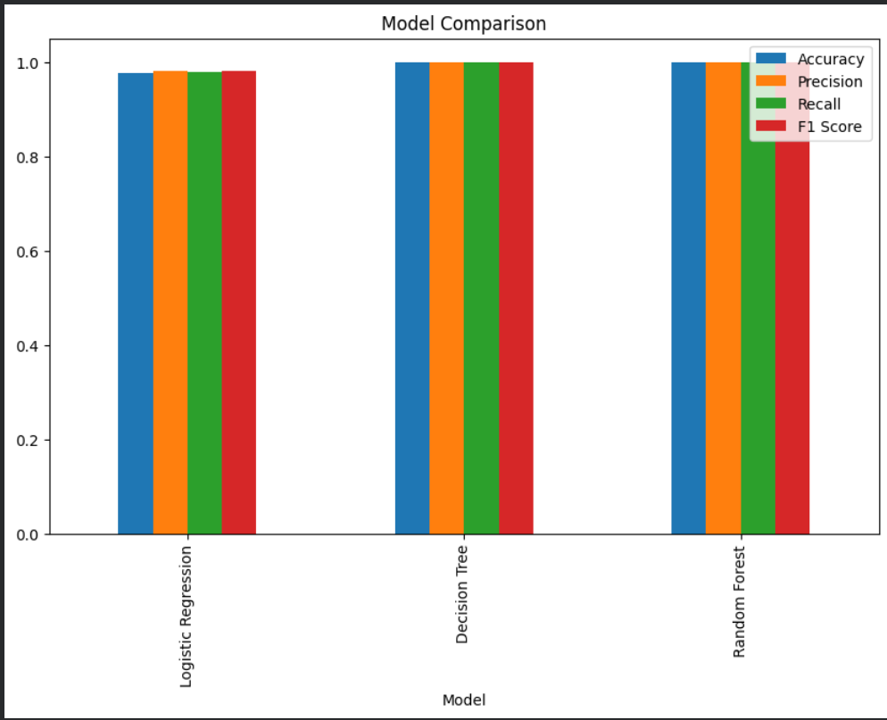
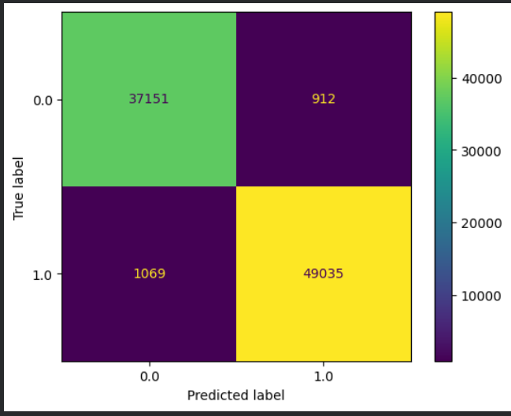
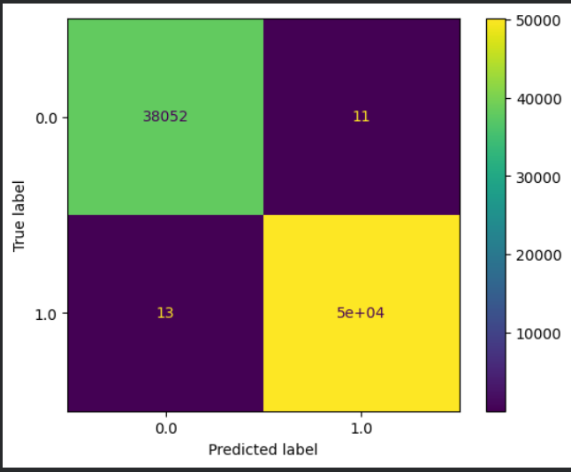
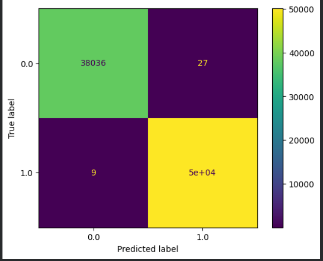
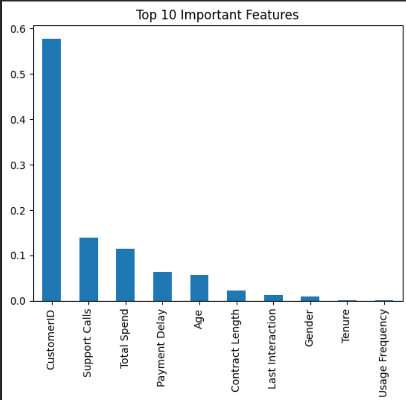

# Customer Churn Prediction using Machine Learning

## Participant Details

**Name:** Manu Krishna C K
**MUID:** *Enter Your MUID Here*

---

# Business Objective

Customer churn is one of the major challenges faced by subscription-based businesses. Losing existing customers leads to reduced revenue and increased acquisition costs. The objective of this project is to build machine learning classification models that can accurately predict whether a customer is likely to churn based on customer demographics, subscription details, and service usage patterns. Early prediction enables businesses to implement proactive customer retention strategies.

---

# Dataset Overview

* **Dataset Name:** Customer Churn Dataset
* **Source:** Kaggle
* **Total Records:** 440,832
* **Input Features:** 11
* **Target Variable:** Churn

### Dataset Preview

> *(Replace the image below with a screenshot of `df.head()`.)*

<p align="center">
  
</p>

---

# Features

* CustomerID *(Removed during preprocessing)*
* Age
* Gender
* Tenure
* Usage Frequency
* Support Calls
* Payment Delay
* Subscription Type
* Contract Length
* Total Spend
* Last Interaction

### Target Variable

| Value | Description          |
| ----- | -------------------- |
| 0     | Customer is retained |
| 1     | Customer has churned |

---

# Data Preprocessing

The following preprocessing steps were performed:

* Removed the row containing missing values.
* Removed the **CustomerID** column since it is only an identifier.
* Encoded categorical features using Label Encoding.
* Split the dataset into training (80%) and testing (20%) sets using stratified sampling.
* Applied StandardScaler for Logistic Regression.
* Verified that the dataset contained no missing values before training.

---

# Machine Learning Models

The following models were trained and evaluated:

* Logistic Regression
* Decision Tree Classifier
* Random Forest Classifier

---

# Evaluation Metrics

The models were evaluated using:

* Accuracy
* Precision
* Recall
* F1-Score
* Confusion Matrix

---

# Model Performance Comparison

| Model               |   Accuracy |  Precision |     Recall |   F1-Score |
| ------------------- | ---------: | ---------: | ---------: | ---------: |
| Logistic Regression |     97.75% |     98.17% |     97.87% |     98.02% |
| Decision Tree       | **99.97%** | **99.98%** | **99.97%** | **99.98%** |
| Random Forest       |     99.96% |     99.95% |     99.98% |     99.96% |

### Model Comparison Chart

<p align="center">
  
</p>

---

# Confusion Matrices

## Logistic Regression

<p align="center">
  
</p>

---

## Decision Tree

<p align="center">
  
</p>

---

## Random Forest

<p align="center">
  
</p>

---

# Feature Importance (Random Forest)

The Random Forest model provides feature importance scores that help identify which customer attributes contribute most to churn prediction.

<p align="center">
  
</p>

---

# Best Performing Model

## Decision Tree Classifier

The Decision Tree achieved the highest performance among all evaluated models.

### Justification

* Highest Accuracy (99.97%)
* Highest Precision (99.98%)
* Highest Recall (99.97%)
* Highest F1-Score (99.98%)
* Lowest number of misclassified samples
* Excellent ability to distinguish churned and retained customers

---

# Key Observations

* Customer behavior and subscription-related features significantly influence churn.
* Decision Tree outperformed all other models.
* Random Forest also achieved excellent performance with nearly identical results.
* Logistic Regression performed well but was comparatively less effective in capturing non-linear relationships.

---

# Business Recommendations

* Identify customers predicted to churn and proactively engage them with retention campaigns.
* Offer discounts, loyalty rewards, or personalized subscription plans to high-risk customers.
* Closely monitor customers with frequent support calls and delayed payments.
* Promote longer contract plans to improve customer retention.
* Periodically retrain the model using updated customer data.

---

# Future Improvements

* Hyperparameter tuning using GridSearchCV or RandomizedSearchCV.
* K-Fold Cross Validation.
* Experiment with XGBoost, LightGBM, and CatBoost.
* Apply SHAP values for model explainability.
* Deploy the model using Streamlit or Flask.

---

# Technologies Used

* Python
* Pandas
* NumPy
* Matplotlib
* Scikit-learn
* Jupyter Notebook

---

# Project Structure

```text
Customer-Churn-Prediction/
│
├── customer_churn_prediction.ipynb
├── README.md
├── requirements.txt
├── dataset/
│   └── customer_churn_dataset-testing-master
    |__customer_churn_dataset-training-master
├── images/
│   ├── dataset_preview.png
│   ├── model_comparison.png
│   ├── confusion_matrix_lr.png
│   ├── confusion_matrix_dt.png
│   ├── confusion_matrix_rf.png
│   └── feature_importance.png
```

---

# Conclusion

This project demonstrates the application of machine learning classification techniques for customer churn prediction. Among the evaluated models, the **Decision Tree Classifier** achieved the best overall performance with an accuracy of **99.97%**, making it the most suitable model for this dataset. Accurate churn prediction enables businesses to identify customers at risk of leaving and implement proactive retention strategies, improving customer satisfaction while reducing revenue loss.
